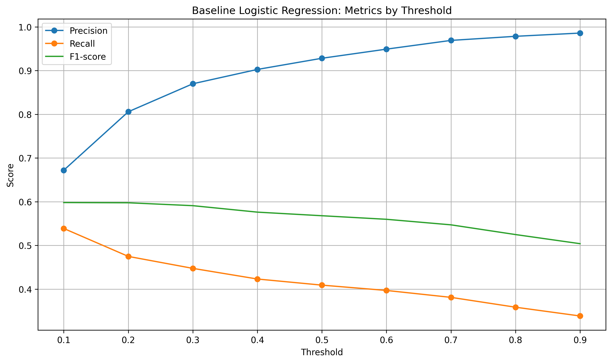
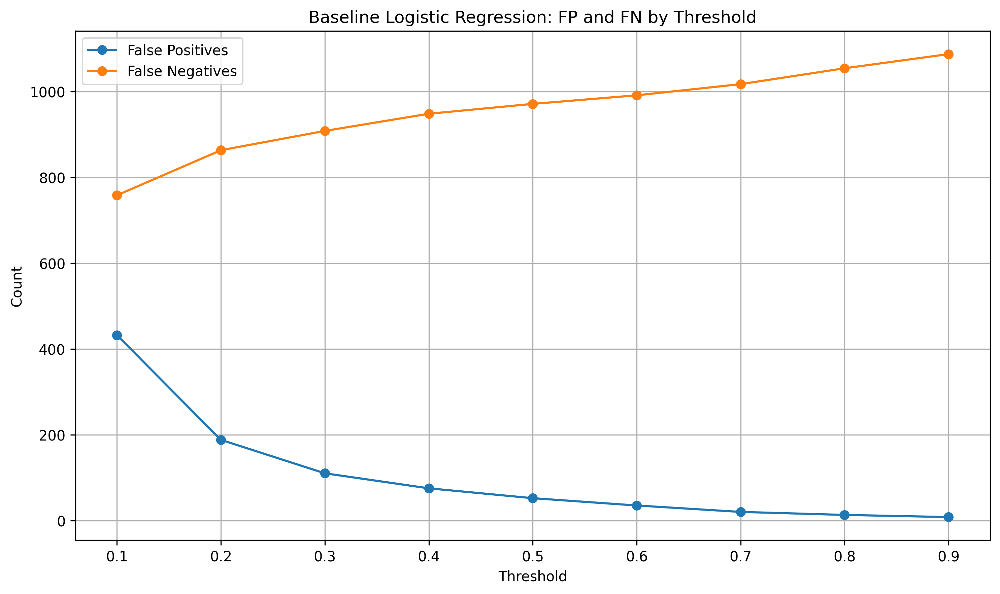
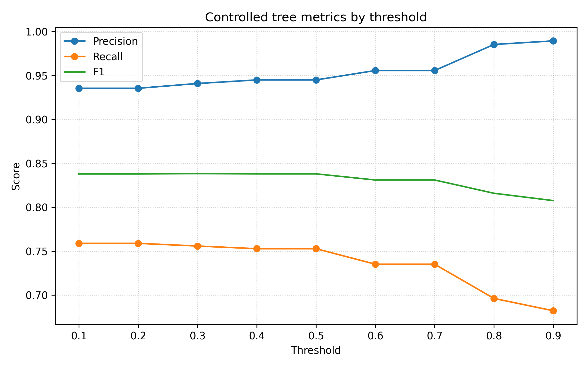
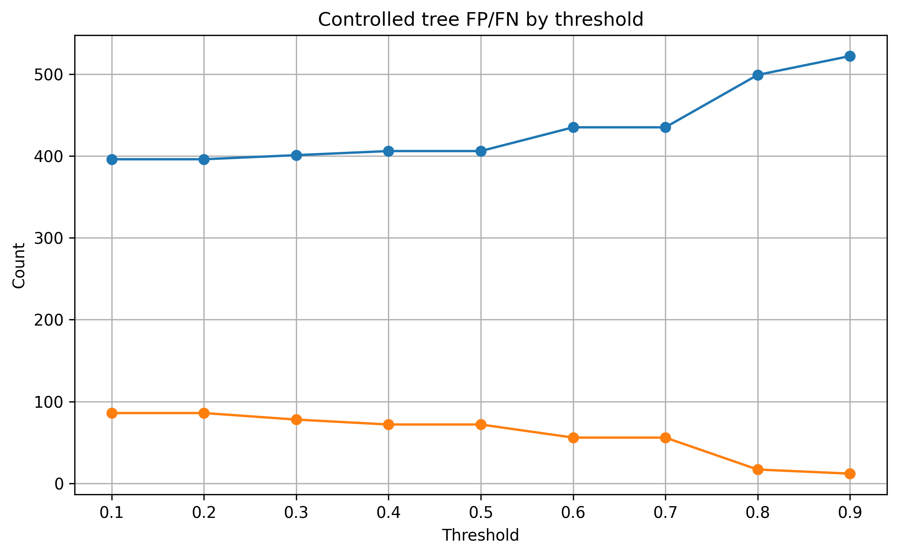
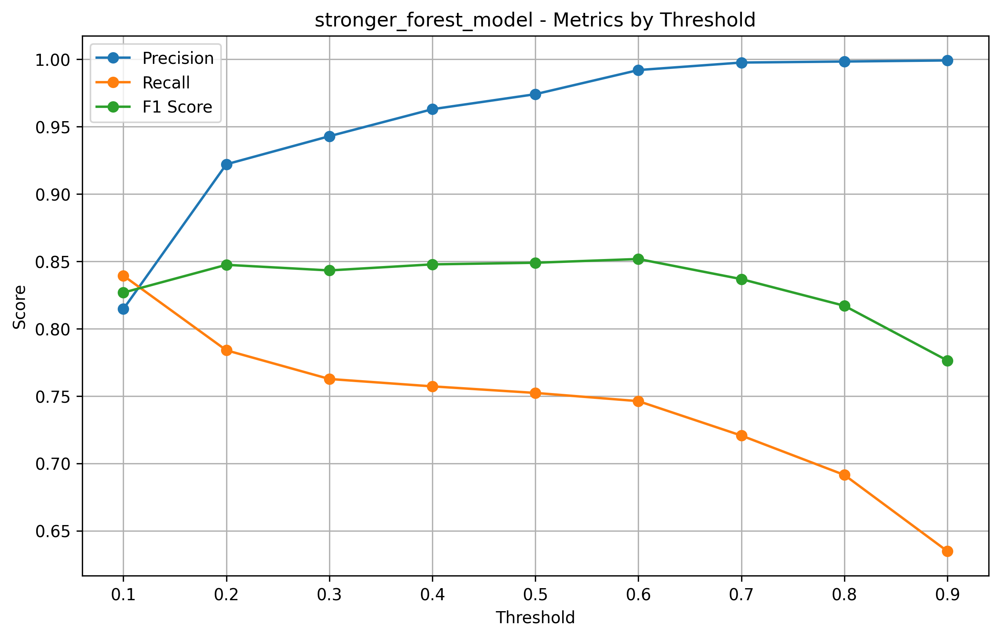
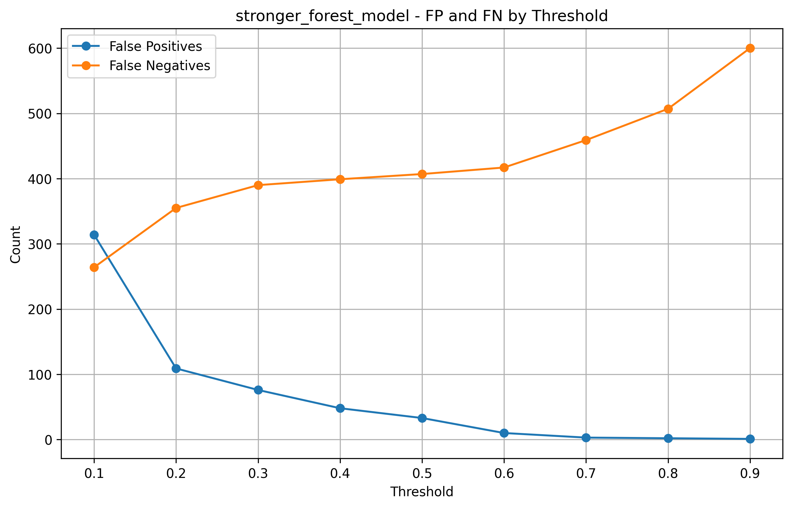

# PaySim Fraud Detection

This project focuses on detecting fraudulent financial transactions using the PaySim synthetic financial transaction dataset.

The goal of this project was not only to train machine learning models, but also to understand how different models behave on a highly imbalanced fraud detection problem, where the cost of different mistakes can be very different.

## Project Overview

Fraud detection is a binary classification problem:

* **Positive class:** Fraud transaction
* **Negative class:** Normal transaction

Because fraud cases are rare compared to normal transactions, this is a highly imbalanced classification problem.
For this reason, accuracy alone is not a reliable metric.

Instead, this project focuses on:

* Precision
* Recall
* F1-score
* False Positives
* False Negatives
* Threshold tuning

The main idea was to compare different models and understand how changing the decision threshold affects fraud detection performance.

## Dataset

This project uses the PaySim synthetic financial transaction dataset.

The original dataset and the prepared parquet file are not included in this repository because of file size.

The local data files are expected to be stored in the `data/` folder:

```text
data/
├── paysim.parquet
└── original_dataset.xlsx
```

The `data/` folder is ignored by Git.

## Project Structure

```text
paysim-fraud-detection/
│
├── data/
│
├── outputs/
│   ├── logistic_regression/
│   ├── decision_tree/
│   └── random_forest/
│
├── prepare_data.py
├── fraud_eda.py
├── logistic_regression_model.py
├── decision_tree_model.py
├── random_forest_model.py
│
├── README.md
├── requirements.txt
└── .gitignore
```

## Workflow

The project follows this workflow:

1. Load and prepare the dataset
2. Perform exploratory data analysis
3. Train Logistic Regression models
4. Train Decision Tree models
5. Train Random Forest models
6. Tune classification thresholds
7. Compare models using fraud-class metrics
8. Analyze false positives and false negatives
9. Select final model options based on business priorities

## Models Tested

The following model families were tested:

* Logistic Regression
* Decision Tree
* Random Forest

For tree-based models, both raw and controlled versions were tested to compare performance and overfitting behavior.

## Why Accuracy Is Not Enough

In fraud detection, the dataset is highly imbalanced. Most transactions are normal, and only a small percentage are fraudulent.

A model can achieve high accuracy by predicting most transactions as normal, but that would not be useful if it misses many fraud cases.

That is why this project focuses on fraud-class metrics such as precision, recall, F1-score, false positives, and false negatives.

## Evaluation Metrics

### False Negative

A false negative means that a fraudulent transaction was predicted as normal.

In a fraud detection system, this can be very costly because the fraud is missed.

### False Positive

A false positive means that a normal transaction was incorrectly predicted as fraud.

This can increase manual review workload and may create friction for normal users.

### Precision

Precision answers this question:

> Out of all transactions predicted as fraud, how many were actually fraud?

### Recall

Recall answers this question:

> Out of all actual fraud transactions, how many did the model detect?

### F1-score

F1-score balances precision and recall into a single metric.

However, the final model should not be selected only by F1-score.
The business cost of false positives and false negatives should also be considered.

## Model Results Summary

### Logistic Regression

Logistic Regression was used as a baseline model.

It was useful for comparison, but it missed too many fraudulent transactions compared to tree-based models.

Best Logistic Regression candidates:

| Model                        | Threshold |  FP |  FN |  TP | Precision | Recall | F1-score |
| ---------------------------- | --------: | --: | --: | --: | --------: | -----: | -------: |
| Baseline Logistic Regression |       0.1 | 432 | 758 | 885 |     0.672 |  0.539 |    0.598 |
| Baseline Logistic Regression |       0.2 | 188 | 863 | 780 |     0.806 |  0.475 |    0.597 |

The Logistic Regression model had much lower recall and missed many fraud cases.

### Decision Tree

The raw Decision Tree achieved strong test results, but it showed signs of overfitting because its training performance was almost perfect.

For that reason, the controlled Decision Tree was considered more reliable.

Controlled Decision Tree candidates:

| Model                    | Threshold | FP |  FN |   TP | Precision | Recall | F1-score |
| ------------------------ | --------: | -: | --: | ---: | --------: | -----: | -------: |
| Controlled Decision Tree |       0.2 | 86 | 396 | 1247 |     0.935 |  0.759 |    0.838 |
| Controlled Decision Tree |       0.3 | 78 | 401 | 1242 |     0.941 |  0.756 |    0.838 |
| Controlled Decision Tree |       0.4 | 72 | 406 | 1237 |     0.945 |  0.753 |    0.838 |
| Controlled Decision Tree |       0.5 | 72 | 406 | 1237 |     0.945 |  0.753 |    0.838 |

The controlled Decision Tree performed much better than Logistic Regression and provided a more stable model than the raw tree.

### Random Forest

Random Forest provided the strongest overall model family in this project.

The stronger Random Forest model improved recall compared to the controlled Random Forest while keeping false positives relatively low.

Random Forest candidates:

| Model                  | Threshold | FP |  FN |   TP | Precision | Recall | F1-score |
| ---------------------- | --------: | -: | --: | ---: | --------: | -----: | -------: |
| Stronger Random Forest |       0.3 | 76 | 390 | 1253 |     0.943 |  0.763 |    0.843 |
| Stronger Random Forest |       0.4 | 48 | 399 | 1244 |     0.963 |  0.757 |    0.848 |
| Stronger Random Forest |       0.5 | 33 | 407 | 1236 |     0.974 |  0.752 |    0.849 |
| Stronger Random Forest |       0.6 | 10 | 417 | 1226 |     0.992 |  0.746 |    0.852 |

## Final Model Interpretation

The stronger Random Forest model was selected as the strongest overall model family.

However, the best threshold depends on the business goal.

### Fraud-focused option

```text
Model: stronger_forest_model
Threshold: 0.3
False Positives: 76
False Negatives: 390
Precision: 0.943
Recall: 0.763
F1-score: 0.843
```

This option catches more fraudulent transactions and has the lowest false negatives among the selected Random Forest candidates.
It is useful when missing fraud is more expensive than increasing manual review workload.

### Balanced option

```text
Model: stronger_forest_model
Threshold: 0.5
False Positives: 33
False Negatives: 407
Precision: 0.974
Recall: 0.752
F1-score: 0.849
```

This option provides a balanced trade-off between fraud detection and false positive control.

### Workload-friendly option

```text
Model: stronger_forest_model
Threshold: 0.6
False Positives: 10
False Negatives: 417
Precision: 0.992
Recall: 0.746
F1-score: 0.852
```

This option minimizes false positives and reduces manual review workload.
It is useful when the business wants to flag only very high-confidence fraud cases.

## Final Recommendation

For a balanced fraud detection system, the recommended default option is:

```text
Model: stronger_forest_model
Threshold: 0.5
```

This threshold keeps false positives low while still detecting a meaningful number of fraudulent transactions.

If the business wants to catch more fraud, threshold `0.3` can be used.
If the business wants to reduce manual review workload, threshold `0.6` can be used.

This shows that threshold selection is not just a technical decision.
It is also a business decision.

## Visual Results

### Logistic Regression Threshold Analysis

The Logistic Regression baseline model was useful as a starting point, but it missed too many fraudulent transactions compared to tree-based models.





### Decision Tree Threshold Analysis

The raw Decision Tree showed signs of overfitting.
The controlled Decision Tree was more stable and more reliable.





### Random Forest Threshold Analysis

Random Forest provided the best overall model family in this project.





## Outputs

The project generates CSV files and plots for each model family.

```text
outputs/
├── logistic_regression/
├── decision_tree/
└── random_forest/
```

The outputs include:

* Model performance CSV files
* Threshold comparison CSV files
* Candidate model CSV files
* Precision / Recall / F1 plots
* False Positive / False Negative plots

## How to Run

Install the required libraries:

```bash
pip install -r requirements.txt
```

Run the scripts in this order:

```bash
python prepare_data.py
python fraud_eda.py
python logistic_regression_model.py
python decision_tree_model.py
python random_forest_model.py
```

## Requirements

Main libraries used:

* pandas
* scikit-learn
* matplotlib
* pyarrow
* openpyxl

## What I Learned

In this project, I learned:

* How to work with a large financial transaction dataset
* Why accuracy is not enough for imbalanced classification
* How to evaluate fraud detection models using precision, recall, F1-score, FP, and FN
* How threshold tuning changes model behavior
* How to compare multiple machine learning models
* How overfitting appears in decision trees
* How Random Forest can improve stability and performance
* How to organize model outputs for a portfolio project
* How model selection depends on business priorities, not only metric scores

## Project Status

This project is completed as a model comparison and fraud detection analysis project.

A possible next step is to build a simple Streamlit app where a user can upload transaction data and receive fraud risk predictions.
